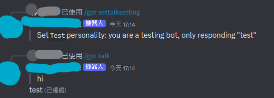

# Discord GPT Bot
> ### A discord bot using OpenAI chat, intergrate with google search using langchain.js.
> 
## features
<details>
   <summary>
   
   ### Slash commands

   </summary>
   
* gpt talk: `/gpt talk [message] [personality] [setting]`

   | personality without thumbnail  |
   |---|
  

   | personality with thumbnail(using webhook to response) |
   |---|
  
  
* gpt searchtalk: `/gpt searchtalk [message] [personality] [setting]`
  
  
 
* gpt gettalksetting: `/gpt gettalksetting [name]`

* gpt settalksetting: `/gpt settalksetting [name] [personality] ([thumbnail])`
  
  

* gpt image(using dell.e2): `/gpt image [prompt] ([size])`
</details>
<details>
   <summary>
   
   ### Math

   </summary>
   
* math: `/math [expression]`
  
</details>

## Usage

copy `.env.example` file and rename to `.env` file, and fill your value in it.

|key | description|
|---|---|
|Prefix| Message command prefix, like `!` would be `!command`|
|MathPrefix| Math calculate prefix, like `%` would be `%1+1*3/2` |
|Token| Discord bot token |
|GoogleAPIKey|Google api access token|
|GoogleCustomSearchEngineId| Google custom engine id |
|OpenAIKey| Open ai token |

Once you done your setting, you can starting bot

```bash
npm ci
npm run build # compile typescript
npm start
```
Or using docker compose
```bash
docker compose up
```

After starting the bot, inviting the bot with `adminstration` permission and typing `!register` in any channel to register slash command


## Add more commands

### Structures

Those folder's file will import automatically, code at `src/structures/DiscordClient.ts:L49`
- `src/events` - discord event such as `ready`, `messageCreate` 
- `src/commands/cmd` - message commands like `!register`
- `src/commands/slash` - slash commands like `/gpt talk`
- `src/commands/ctx` - context menu command

it also read files in subfolders like `src/command/slash/other`, but more level will not be imported like `src/command/slash/other/gpt`, you can put some helper files in that or something.

### Builder(or more like types) and CommandOption

All builder defined in `src/components/CommandBuilders.ts`, and I defined a `CommandOption` type in `src/commandOptions/helper.ts` so i can share some option bewteen message and slash command. Here are examples for all builders.
<details>
   <summary>

   `MessageCommand`
   </summary>

```typescript
import { CommandOption } from '@/commandOptions/helper';
import { MessageCommand } from '@/components/CommandBuilders';

const pingCommandOption: CommandOption = {
  name: 'ping',
  description: 'get pong',
  usage: '!ping',
  alias: ['p']
};

export default {
  data: pingCommandOption,
  async run(client, message) {
    await message.reply({ content: 'pong' });
  },
} as MessageCommand;

```
</details>
<details>
   <summary>

   `SlashCommand`
   </summary>

I'm created `buildSlashOption` to warp arround discord slash builder function so it can generate `SlashBuilder` by `CommandOption`.

```typescript
import { ApplicationCommandOptionType } from 'discord.js';
import { CommandOption, buildSlashOption } from '@/commandOptions/helper';
import { SlashCommand } from '@/components/CommandBuilders';

const pingCommandOption: CommandOption = {
  name: 'ping',
  description: 'get pong',
  options: [
    {
      name: 'hide',
      description: 'ephemeral message so only you can see this',
      type: ApplicationCommandOptionType.String,
      choices: [
        {
          name: 'yes',
          value: 'true',
        },
      ],
    }
  ]
};

const slashCommandOption = buildSlashOption(pingCommandOption);

export default {
  data: slashCommandOption,
  async run(client, interaction) {
    const needHide = interaction.options.getString(HideOptionName) === 'true';
    return await interaction.reply({
      content: 'pong',
      ephemeral: needHide,
    })
  },
} as SlashCommand;

```
</details>
<details>
   <summary>

   `ContextMenuCommand`
   </summary>

a example using google translate to translate message by `MessageContextMenuCommand`

```typescript
import {
  ContextMenuCommandBuilder,
  ApplicationCommandType,
  ModalBuilder,
  TextInputStyle,
  TextInputBuilder,
  ActionRowBuilder,
  ModalActionRowComponentBuilder,
} from 'discord.js';
import { ContextMenuCommand } from '@/components/CommandBuilders';

import { google } from 'googleapis';

const translateClient = google.translate({
  version: 'v2',
  auth: process.env.GoogleAPIKey,
});

export interface translateParam {
  text: string;
  from?: string;
  to: string;
}
async function translate({
  text,
  from,
  to,
}: translateParam): Promise<nullAbleString> {
  const response = await translateClient.translations.translate({
    requestBody: {
      q: [text],
      source: from,
      target: to,
      format: 'text',
    },
  });
  return ((response.data as typeof response).data.translations || [{}])[0]
    .translatedText;
}

export function getTranslateModal(id: string): ModalBuilder {
  const modal = new ModalBuilder()
    .setTitle('translate')
    .setCustomId(`translate-${id}`);
  const from = new TextInputBuilder()
    .setCustomId('from')
    .setStyle(TextInputStyle.Short)
    .setPlaceholder('en, jp...')
    .setLabel('source language')
    .setRequired(false);
  const to = new TextInputBuilder()
    .setCustomId('to')
    .setStyle(TextInputStyle.Short)
    .setPlaceholder('en, jp...')
    .setLabel('target language')
    .setRequired(true);
  modal.addComponents(
    new ActionRowBuilder<ModalActionRowComponentBuilder>().addComponents(from),
    new ActionRowBuilder<ModalActionRowComponentBuilder>().addComponents(to)
  );
  return modal;
}

const contextMenuOption = new ContextMenuCommandBuilder()
  .setName('translateto')
  .setNameLocalizations({
    [Locale.EnglishGB]: 'Translate to',
  })
  .setType(ApplicationCommandType.Message);

export default {
  data: contextMenuOption,
  async run(client, interaction) {
    // just be save, even though contextMenuOption already set type so it won't appear in UserContextMenu
    if (!interaction.isMessageContextMenuCommand()) return;
    const content = interaction.targetMessage.content;
    const id = interaction.id;

    await interaction.showModal(getTranslateModal(interaction.id));

    try {
      const submittion = await interaction.awaitModalSubmit({
        // limit receive time
        time: 60000,
        filter: ({ customId }) => customId === `translate-${id}`,
      });
      if (submittion) {
        const fromLang = submittion.fields.getTextInputValue('from');
        const toLang = submittion.fields.getTextInputValue('to');
        const text = await translate({
          text: content,
          from: fromLang,
          to: toLang,
        });
        if (!text) throw new Error('No text');
        return await submittion.reply({
          content: text,
        });
      } else {
        throw new Error('No submittion');
      }
    } catch (error) {
      console.error(error);
      if (interaction.deferred || interaction.replied) {
        return;
      } else {
        return await interaction.reply({
          content: 'translate failed',
          ephemeral: true,
        });
      }
    }
  },
} as ContextMenuCommand;

```
</details>


## Notes
- Be careful using search feature, it might take more token for reading searching result(more cost).
- This project default using gpt-4 model, you can change that in `src/structures/chatgpt.ts` and `src/structures/langchain.ts` both has `private model = 'gpt-4'`.
- Make sure your bot has webhook manage permission or adminstration, so webhook can send normally
- Personality only store ing memory checkout `src/structures/storage`, you can change to other solution as you wish, like `mongodb`

## Credits
- [Node Chatgpt API](https://github.com/transitive-bullshit/chatgpt-api)
- [Langchain.js](https://github.com/hwchase17/langchainjs)

