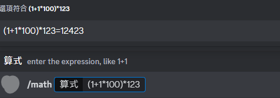

# Discord GPT Bot
> ### A discord bot using OpenAI chat, intergrate with google search using langchain.js.
> 
## features
<details>
   <summary>
   
   ### Slash commands

   </summary>
   
* gpt talk: `/gpt talk [message] [personality] [setting]`

   | personality without thumbnail  |
   |---|
  

   | personality with thumbnail(using webhook to response) |
   |---|
  
  
* gpt searchtalk: `/gpt searchtalk [message] [personality] [setting]`
  
  
 
* gpt gettalksetting: `/gpt gettalksetting [name]`

* gpt settalksetting: `/gpt settalksetting [name] [personality] ([thumbnail])`
  
  

* gpt image(using dell.e2): `/gpt image [prompt] ([size])`
</details>
<details>
   <summary>
   
   ### Math

   </summary>
   
* math: `/math [expression]`
  
</details>

## Usage

copy `.env.example` file and rename to `.env` file, and fill your value in it.

|key | description|
|---|---|
|Prefix| Message command prefix, like `!` would be `!command`|
|MathPrefix| Math calculate prefix, like `%` would be `%1+1*3/2` |
|Token| Discord bot token |
|GoogleAPIKey|Google api access token|
|GoogleCustomSearchEngineId| Google custom engine id |
|OpenAIKey| Open ai token |

Once you done your setting, you can starting bot

```bash
npm ci
npm run build # compile typescript
npm start
```
Or using docker compose
```bash
docker compose up
```

After starting the bot, inviting the bot with `adminstration` permission and typing `!register` in any channel to register slash command


## Notes
- Be careful using search feature, it might take more token for reading searching result(more cost).
- This project default using gpt-4 model, you can change that in `src/structures/chatgpt.ts` and `src/structures/langchain.ts` both has `private model = 'gpt-4'`.
- Make sure your bot has webhook manage permission or adminstration, so webhook can send normally
- Personality only store ing memory checkout `src/structures/storage`, you can change to other solution as you wish, like `mongodb`

## Credits
- [Node Chatgpt API](https://github.com/transitive-bullshit/chatgpt-api)
- [Langchain.js](https://github.com/hwchase17/langchainjs)

